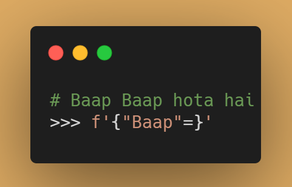
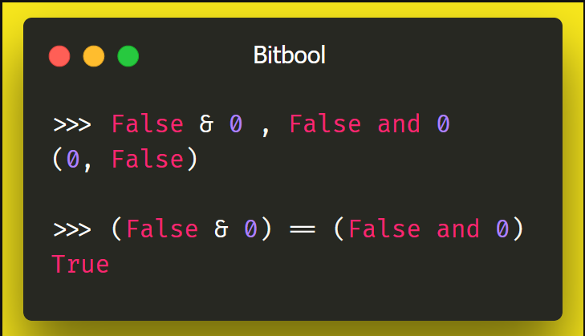

# meme-funcs

Converting memes to Python code :stuck_out_tongue:

### Memes
| Name                                           | Image                                                                 |
|:-----------------------------------------------|-----------------------------------------------------------------------|
| [Akshay Swap](./funcs/akshay_swap.py)          | :joy:                                                                 |
| Baap Baap hota hai  `f"{'Baap'=}"`         |  |
| [Same-Same, but different](./funcs/bitbool.py) |  |

> Share your ideas
