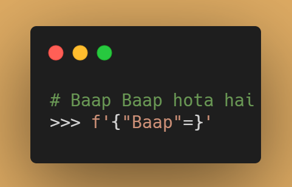
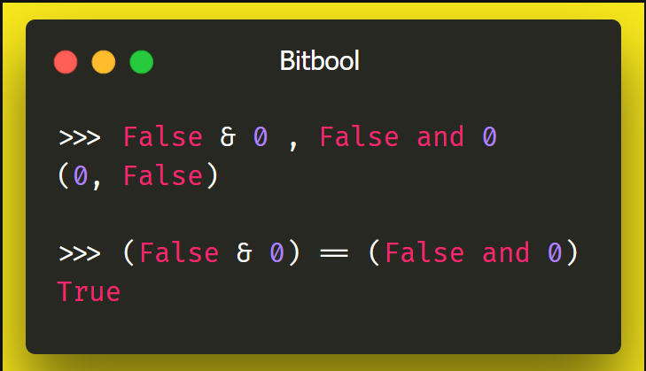

# meme-funcs

| Header 1           | Header 2            |
|--------------------|---------------------|
| Row 1, Col 1       | Row 1, Col 2        |
| Row 2, Col 1       | Row 2, Col 2        |
| Row 3, Col 1       | Row 3, Col 2        |

Converting memes to Python code :stuck_out_tongue:

### Memes
| Name                                           | Image                                                                 |
|------------------------------------------------|-----------------------------------------------------------------------|
| [Akshay Swap](./funcs/vowel_play.py)           | :joy:                                                                 |
| [Brefix](./funcs/vowel_play.py)                | :joy:                                                                 |
| Baap Baap hota hai  `f"{'Baap'=}"`         |  |
| [Same-Same, but different](./funcs/bitbool.py) |  |

> Share your ideas
